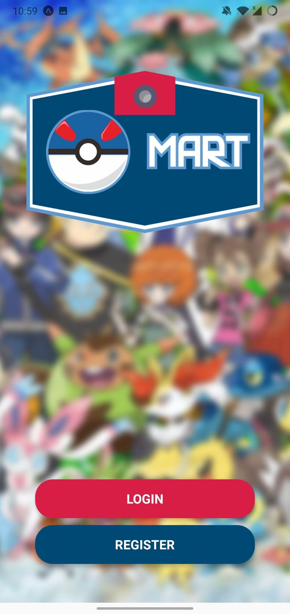

# PokeMart

A marketplace for users to buy and sell everything related to Pokemon!

PokeMart was created using [React Native](https://reactnative.dev/). This was a tutorial project created by Mosh Hamedani which I followed to learn the framework and extended to suit my needs.
The main inspiration behind this app is the recent popularity of Pokemon cards and people collecting them. I thought it would be great to create a marketplace to help users that want to buy and sell Pokemon cards.

The backend of this app is hosted using [Heroku](https://www.heroku.com/).

# Try it out!

You can try my app using [Expo](https://expo.io/@expohahs/projects/PokeMart), by scanning the QR code through the Expo app or try loading the project in your browser.

Or you can try my app by downloading this file on Android using the [APK](PokeMart-4b5e4fe7cf6f49af86ab3258f7c5834e-signed.apk).

# Screens

Here are some screenshots from PokeMart.

